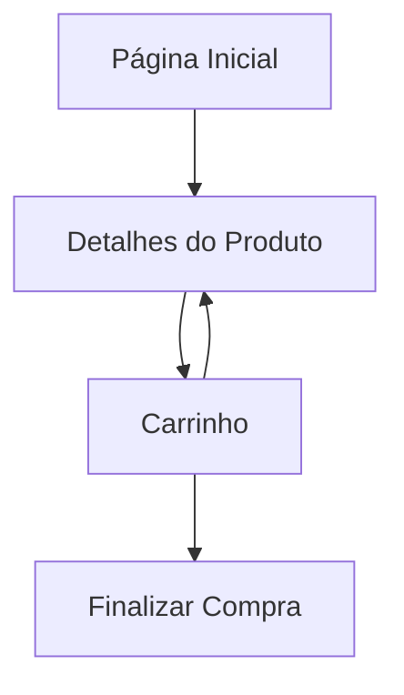

## 1. Product Overview

Nova Custom é um e-commerce especializado em camisas de futebol personalizadas, permitindo aos usuários visualizar, customizar e comprar camisas de seus times favoritos com opções de personalização de nome e número.

O produto visa facilitar a compra de camisas personalizadas com interface intuitiva e processo simplificado, atendendo torcedores que buscam camisas únicas e oficiais de seus clubes.

## 2. Core Features

### 2.1 User Roles
| Role | Registration Method | Core Permissions |
|------|---------------------|------------------|
| Visitante | Não requer registro | Visualizar produtos, adicionar ao carrinho |
| Usuário Registrado | Email e senha | Finalizar compras, salvar histórico de pedidos |

### 2.2 Feature Module

Nosso e-commerce consiste nas seguintes páginas principais:
1. **Página Inicial**: Grade de camisas com imagens e preços, navegação principal.
2. **Detalhes do Produto**: Visualização da camisa, seleção de tamanho, personalização de nome e número.
3. **Carrinho**: Lista de itens selecionados com detalhes de personalização e valores totais.

### 2.3 Page Details

| Page Name | Module Name | Feature description |
|-----------|-------------|---------------------|
| Página Inicial | Grade de Produtos | Exibir camisas em formato de grid com imagens, nomes dos times e preços promocionais. |
| Página Inicial | Navegação Principal | Incluir menu com categorias de times, busca e acesso ao carrinho. |
| Página Inicial | Destaques | Mostrar banner com ofertas especiais e camisas mais vendidas. |
| Detalhes do Produto | Galeria de Imagens | Apresentar múltiplas visualizações da camisa (frente, costas, detalhes). |
| Detalhes do Produto | Seletor de Tamanho | Permitir escolha entre tamanhos P, M, G, GG com indicação de disponibilidade. |
| Detalhes do Produto | Personalização | Oferecer campos opcionais para inserir nome e número para estampagem. |
| Detalhes do Produto | Ação de Compra | Incluir botão "Adicionar ao Carrinho" com confirmação visual. |
| Carrinho | Lista de Itens | Mostrar todas as camisas adicionadas com imagem, tamanho e personalização. |
| Carrinho | Resumo do Pedido | Exibir subtotal, frete e total com botão para finalizar compra. |
| Carrinho | Gerenciamento | Permitir alterar quantidades ou remover itens do carrinho. |

## 3. Core Process

O fluxo principal do usuário inicia na página inicial onde visualiza as camisas disponíveis. Ao clicar em uma camisa, é direcionado para a página de detalhes onde pode selecionar o tamanho e opcionalmente personalizar com nome e número. Após configurar o produto desejado, adiciona ao carrinho e pode continuar comprando ou finalizar o pedido.

## 4. User Interface Design

### 4.1 Design Style
- **Cores Primárias**: Verde (#00A652) e branco, remetendo ao futebol
- **Cores Secundárias**: Preto e cinza claro para textos e detalhes
- **Estilo de Botões**: Arredondados com sombra suave, hover effects verde-escuro
- **Fonte**: Sans-serif moderna (Inter ou Roboto), títulos 24-32px, corpo 14-16px
- **Layout**: Card-based com espaçamento generoso, navegação superior fixa
- **Ícones**: Estilo line-art minimalista, foco em símbolos esportivos

### 4.2 Page Design Overview

| Page Name | Module Name | UI Elements |
|-----------|-------------|-------------|
| Página Inicial | Grade de Produtos | Cards 280x320px com imagem 4:3, overlay de preço em verde, hover zoom suave de 1.05x. |
| Página Inicial | Navegação | Header fixo branco com logo, menu horizontal, ícone do carrinho com badge de quantidade. |
| Detalhes do Produto | Galeria | Carousel com thumbnails verticais, imagem principal responsiva max-width 600px. |
| Detalhes do Produto | Personalização | Inputs com bordas arredondadas 8px, placeholder em português, validação em tempo real. |
| Carrinho | Lista de Itens | Cards compactos com imagem 80x80px, texto de personalização em verde, botões de ação ícones. |
| Carrinho | Resumo | Box branco com sombra, valores em negrito, botão primário verde grande arredondado. |

### 4.3 Responsiveness
Desktop-first com adaptação mobile completa. Breakpoints em 768px e 480px. Em mobile, menu hambúrguer, grid de produtos single-column, carrinho slide-in lateral. Touch otimizado com áreas de toque mínimas 44x44px.